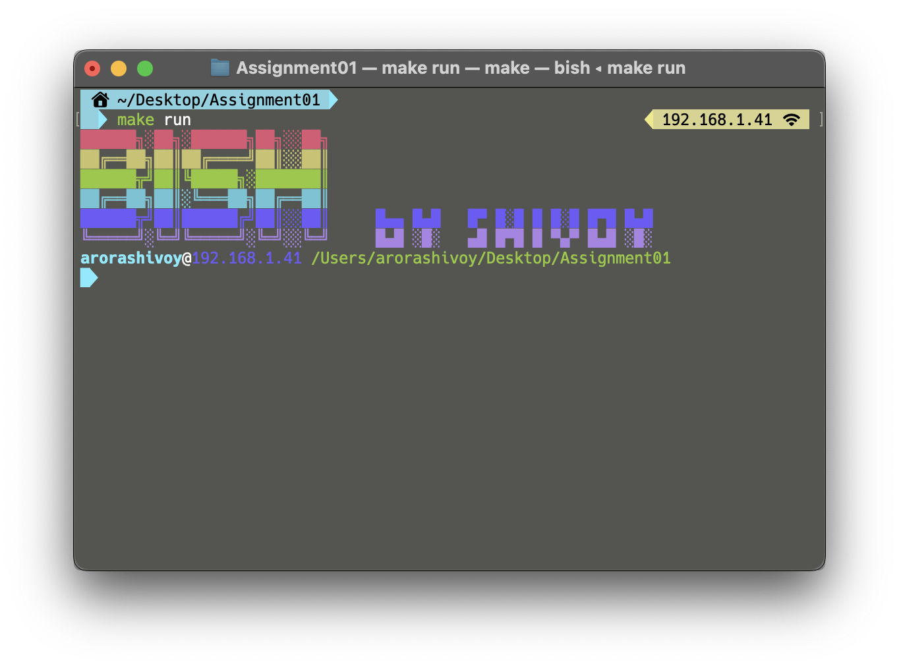
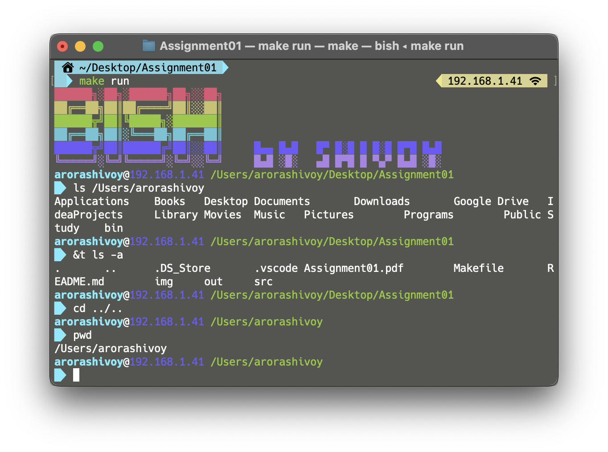
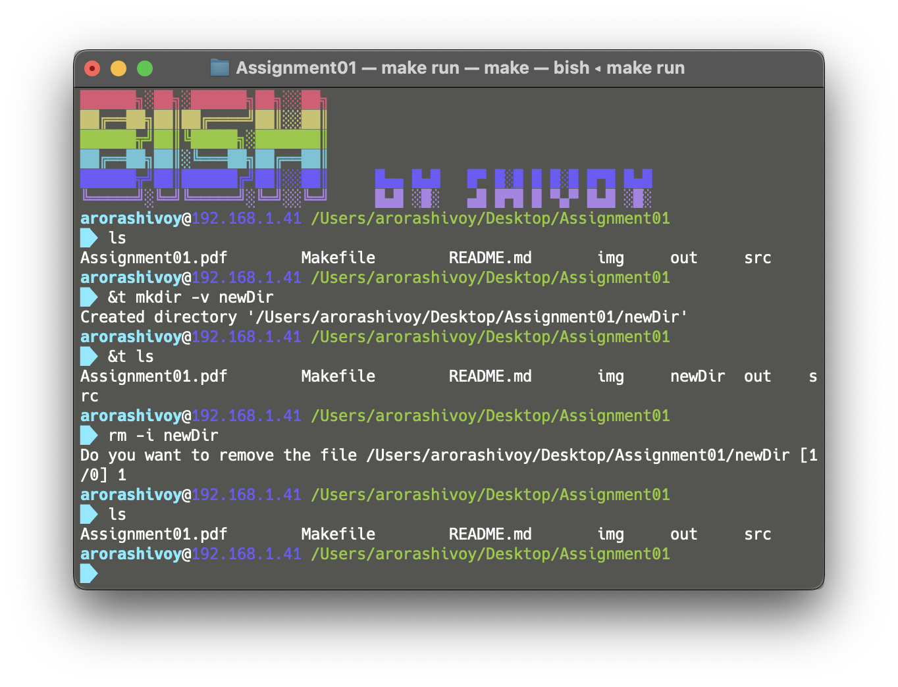

# bish (Bullshit Interactive SHell)
#### By - [Shivoy Arora](https://github.com/arorashivoy)

This is an interactive Linux shell made in C using forks and threads

**Problem Statement:** [Assignment01](Assignment01.pdf)

## How to run
* To compile the code run `make`
* To run the shell run `make run`
* Or you can also open the executable `./out/bish`
* The allowed commands with their rules are listed [below](#commands)

## Important Points
* Only **10 words** (space-separated) can be typed in the prompt
* Each word in the prompt can't be longer than **100 letters**
* Using `&t` at the start of the command executes it using thread instead of fork
	* eg - to execute `ls` via thread method type `&t ls`
* Only the last command option will be considered for execution

## Commands
### Internal Commands

#### `pwd`
* Options
  * `-L` Display the logical current working directory
  * `-P` Display the physical current working directory
* Warnings
  * Command-line option not recognized

#### `echo`
* Options
  * `-n` do not output the trailing newline
  * `-E` disable interpretation of backslash escapes
* Assumption
  * For this the command line option at the very end will be considered

#### `cd`
* Options
  * `-L` Handle the operand dot-dot logically
  * `-P` Handle the operand dot-dot physically
* Assumptions
  * There are no spaces in the path
* Warnings
  * no such file or directory

### External Commands

#### `ls`
* Options
  * `-a` do not ignore entries starting with .
  * `-A` do not list implied . and ..
* Assumptions
  * There are no spaces in between the path
  * If multiple paths are entered then the last path is considered
* Warnings
  * No such file or directory

#### `date`
* Options
  * `-u` show the GMT time
  * `-R` output date and time in RFC 5322 format

#### `rm`
* Options
  * `-f` ignore nonexistent files and arguments, never prompt
  * `-i` prompt before every removal
* Warnings
  * Missing operands
  * File doesn't exist

#### `cat`
* Options
  * `-E` display $ at end of each line
  * `-n` number all output lines
* Warning
  * File name not entered
  * File doesn't exist

#### `mkdir`
* Options
  * `-v` print a message for each created directory
  * `-p` no error if existing, make parent directories as needed
* Warning
  * Directory name not entered
  * Unable to create the directory

## Screenshots

